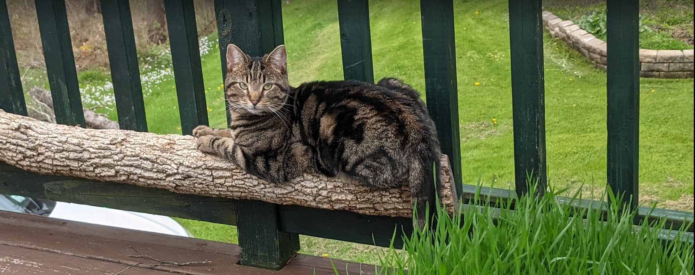

# Project Nyx

On May 15, 2021, the cat named Nyxie went missing.

This project is a collection of resources and tools for bringing her back home.

## Ideas

| idea (put anything down; nothing is stupid)    | value (0-5) | difficulty ([1, 3, 5, 8…]) | refs                                       |
| ---------------------------------------------- | ----------- | -------------------------- | ------------------------------------------ |
| internet access wisenet cameras                | 2           | 3                          | [[1]](refs/wisenet_camera_nvr_manual.pdf), |
| online nest outdoor camera                     | 1           | 1                          |                                            |
| install camera #4 wisenet                      | 3           | 1                          |                                            |
| trail cameras                                  | 3           | 3                          |                                            |
| food outside                                   | 2           | 1                          |                                            |
| litterbox outside                              | 1           | 1                          |                                            |
| rfid perimeter                                 | 0           | 13                         |                                            |
| have a heart traps                             | 2           | 1                          |                                            |
| cat cooler shelters                            | 1           | 3                          |                                            |
| map grid search pattern weighted probabilities | 4           | 3                          |                                            |
| clear brush                                    | 4           | 5                          |                                            |
| kill insects around wisenet cameras            | 2           | 3                          |                                            |
| readjust cameras to minimize motion noise      | 1           | 3                          |                                            |
| thermal imaging                                | 4           | 5                          |                                            |
| facebook post                                  | 3           | 1                          |                                            |
| facebook neighborhood post                     | 3           | 1                          |                                            |
| craigslist post                                | 1           | 1                          | [[1]](https://binghamton.craigslist.org/)  |

## Search

## TODO

Add content for:

- contributing
- grid search
- automated saving/organizing security footage
- automated saving/organizing trailcam footage
